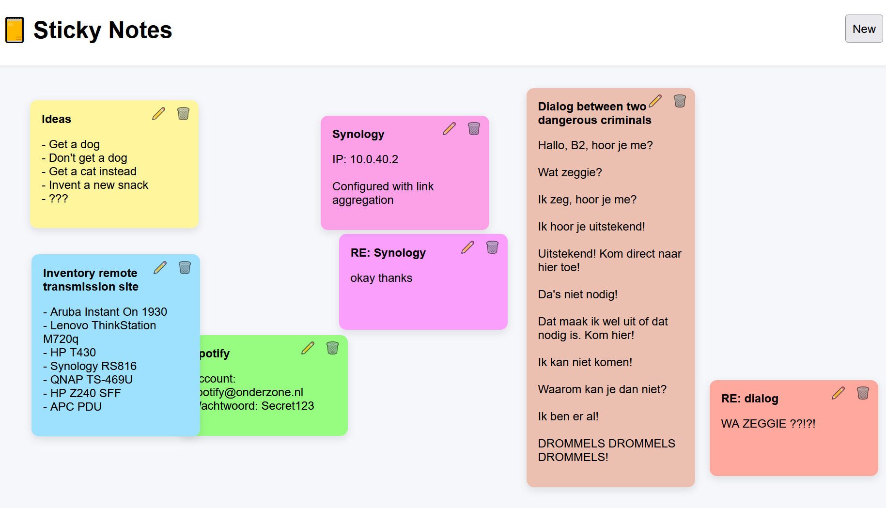

# Sticky Notes
Basic Sticky Notes for PHP and MySQL. Desktop and mobile-friendly. No authentication. 

[Online Demo](https://onderzone.nl/notities)

**You can:**
- Create, modify and delete a Sticky Note
- Change it's color
- Move it around

**Requirements:**
- A webserver
- PHP 8.4
- MySQL 8.0 or MariaDB 10.11 or newer

**Instructions:**
1. Upload all the files to your host
2. Create a database (utf8mb4_unicode_ci)
3. Create the table (use database_setup.sql)
4. Edit config.php

**Notes:**
- All data is stored in a single mySQL table.
- There is no authentication. Anyone that knows the URL can add and modify! Use at own risk! Provide your own protection!
- It uses CSRF-tokens against bots.
- Works with mouse and touch.
- HTML gets converted to readable text.

**To do:**
- Basic formatting (bold, italic, lists)
- Clickable links
- Dark Mode
